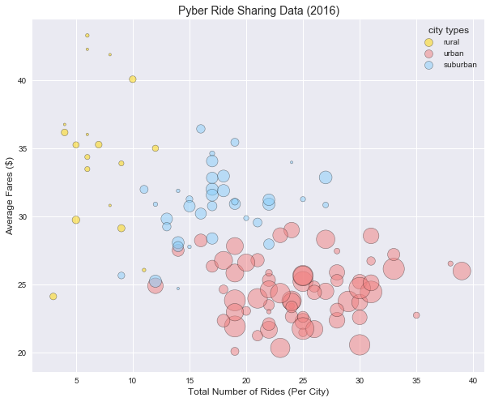
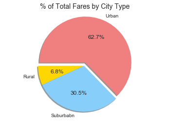
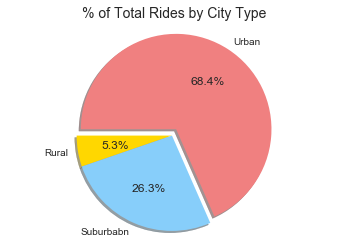
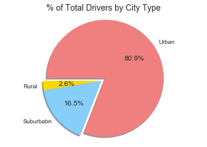

```python
import pandas as pd
import seaborn as sns
import matplotlib.pyplot as plt
%matplotlib inline
import numpy as np
```


```python
city = pd.read_csv('city_data.csv')
ride = pd.read_csv('ride_data.csv')

```

###  Average Fare ($) Per City


```python
avg_fare = ride.groupby(['city'])['fare'].mean().map('${:.2f}'.format).sort_values()
avg_fare.reset_index()[:5]
```


<div>
<style scoped>
    .dataframe tbody tr th:only-of-type {
        vertical-align: middle;
    }

    .dataframe tbody tr th {
        vertical-align: top;
    }

    .dataframe thead th {
        text-align: right;
    }
</style>
<table border="1" class="dataframe">
  <thead>
    <tr style="text-align: right;">
      <th></th>
      <th>city</th>
      <th>fare</th>
    </tr>
  </thead>
  <tbody>
    <tr>
      <th>0</th>
      <td>South Latoya</td>
      <td>$20.09</td>
    </tr>
    <tr>
      <th>1</th>
      <td>West Gabriel</td>
      <td>$20.35</td>
    </tr>
    <tr>
      <th>2</th>
      <td>Royland</td>
      <td>$20.57</td>
    </tr>
    <tr>
      <th>3</th>
      <td>Leahton</td>
      <td>$21.24</td>
    </tr>
    <tr>
      <th>4</th>
      <td>Raymondhaven</td>
      <td>$21.48</td>
    </tr>
  </tbody>
</table>
</div>


### Total Number of Rides Per City


```python
ride_count = ride.groupby('city')['fare'].count().sort_values(ascending = False)
ride_count.reset_index()[:5]
```


<div>
<style scoped>
    .dataframe tbody tr th:only-of-type {
        vertical-align: middle;
    }

    .dataframe tbody tr th {
        vertical-align: top;
    }

    .dataframe thead th {
        text-align: right;
    }
</style>
<table border="1" class="dataframe">
  <thead>
    <tr style="text-align: right;">
      <th></th>
      <th>city</th>
      <th>fare</th>
    </tr>
  </thead>
  <tbody>
    <tr>
      <th>0</th>
      <td>West Angela</td>
      <td>39</td>
    </tr>
    <tr>
      <th>1</th>
      <td>South Karenland</td>
      <td>38</td>
    </tr>
    <tr>
      <th>2</th>
      <td>North Jason</td>
      <td>35</td>
    </tr>
    <tr>
      <th>3</th>
      <td>Port Frank</td>
      <td>33</td>
    </tr>
    <tr>
      <th>4</th>
      <td>Liumouth</td>
      <td>33</td>
    </tr>
  </tbody>
</table>
</div>


### Total Number of Drivers Per City


```python
city.groupby('city')['driver_count']
city.drop('type', 1)[:5]

```


<div>
<style scoped>
    .dataframe tbody tr th:only-of-type {
        vertical-align: middle;
    }

    .dataframe tbody tr th {
        vertical-align: top;
    }

    .dataframe thead th {
        text-align: right;
    }
</style>
<table border="1" class="dataframe">
  <thead>
    <tr style="text-align: right;">
      <th></th>
      <th>city</th>
      <th>driver_count</th>
    </tr>
  </thead>
  <tbody>
    <tr>
      <th>0</th>
      <td>Richardfort</td>
      <td>38</td>
    </tr>
    <tr>
      <th>1</th>
      <td>Williamsstad</td>
      <td>59</td>
    </tr>
    <tr>
      <th>2</th>
      <td>Port Angela</td>
      <td>67</td>
    </tr>
    <tr>
      <th>3</th>
      <td>Rodneyfort</td>
      <td>34</td>
    </tr>
    <tr>
      <th>4</th>
      <td>West Robert</td>
      <td>39</td>
    </tr>
  </tbody>
</table>
</div>


```python
city_ride_join = pd.merge(city, ride, how='inner', on = 'city')
city_ride_join.head()
```


<div>
<style scoped>
    .dataframe tbody tr th:only-of-type {
        vertical-align: middle;
    }

    .dataframe tbody tr th {
        vertical-align: top;
    }

    .dataframe thead th {
        text-align: right;
    }
</style>
<table border="1" class="dataframe">
  <thead>
    <tr style="text-align: right;">
      <th></th>
      <th>city</th>
      <th>driver_count</th>
      <th>type</th>
      <th>date</th>
      <th>fare</th>
      <th>ride_id</th>
    </tr>
  </thead>
  <tbody>
    <tr>
      <th>0</th>
      <td>Richardfort</td>
      <td>38</td>
      <td>Urban</td>
      <td>2018-02-24 08:40:38</td>
      <td>13.93</td>
      <td>5628545007794</td>
    </tr>
    <tr>
      <th>1</th>
      <td>Richardfort</td>
      <td>38</td>
      <td>Urban</td>
      <td>2018-02-13 12:46:07</td>
      <td>14.00</td>
      <td>910050116494</td>
    </tr>
    <tr>
      <th>2</th>
      <td>Richardfort</td>
      <td>38</td>
      <td>Urban</td>
      <td>2018-02-16 13:52:19</td>
      <td>17.92</td>
      <td>820639054416</td>
    </tr>
    <tr>
      <th>3</th>
      <td>Richardfort</td>
      <td>38</td>
      <td>Urban</td>
      <td>2018-02-01 20:18:28</td>
      <td>10.26</td>
      <td>9554935945413</td>
    </tr>
    <tr>
      <th>4</th>
      <td>Richardfort</td>
      <td>38</td>
      <td>Urban</td>
      <td>2018-04-17 02:26:37</td>
      <td>23.00</td>
      <td>720020655850</td>
    </tr>
  </tbody>
</table>
</div>


```python
# varaible for grouped cities
cities = city_ride_join.groupby('city')

# average fare by city
avg_fare = cities['fare'].mean()#.map('${:.2f}'.format)

# rides per city
ride_count = cities['type'].count()

# Total Number of Drivers Per City
drivers = cities['driver_count'].max()


# City Type (Urban, Suburban, Rural)
city_type = cities['type'].max()

```


```python
#merge into one dataframe
ride_analysis = pd.DataFrame({'average fare': avg_fare,
                        '# of rides': ride_count,
                        'drivers': drivers,
                        'city type': city_type})
ride_analysis.reset_index().nlargest(25, "drivers")
```


<div>
<style scoped>
    .dataframe tbody tr th:only-of-type {
        vertical-align: middle;
    }

    .dataframe tbody tr th {
        vertical-align: top;
    }

    .dataframe thead th {
        text-align: right;
    }
</style>
<table border="1" class="dataframe">
  <thead>
    <tr style="text-align: right;">
      <th></th>
      <th>city</th>
      <th># of rides</th>
      <th>average fare</th>
      <th>city type</th>
      <th>drivers</th>
    </tr>
  </thead>
  <tbody>
    <tr>
      <th>116</th>
      <td>West Samuelburgh</td>
      <td>25</td>
      <td>21.767600</td>
      <td>Urban</td>
      <td>73</td>
    </tr>
    <tr>
      <th>96</th>
      <td>South Michelleport</td>
      <td>31</td>
      <td>24.451613</td>
      <td>Urban</td>
      <td>72</td>
    </tr>
    <tr>
      <th>105</th>
      <td>West Anthony</td>
      <td>30</td>
      <td>24.736667</td>
      <td>Urban</td>
      <td>70</td>
    </tr>
    <tr>
      <th>43</th>
      <td>Liumouth</td>
      <td>33</td>
      <td>26.150000</td>
      <td>Urban</td>
      <td>69</td>
    </tr>
    <tr>
      <th>71</th>
      <td>Port Angela</td>
      <td>19</td>
      <td>23.836842</td>
      <td>Urban</td>
      <td>67</td>
    </tr>
    <tr>
      <th>79</th>
      <td>Reynoldsfurt</td>
      <td>19</td>
      <td>21.919474</td>
      <td>Urban</td>
      <td>67</td>
    </tr>
    <tr>
      <th>13</th>
      <td>East Kaylahaven</td>
      <td>29</td>
      <td>23.757931</td>
      <td>Urban</td>
      <td>65</td>
    </tr>
    <tr>
      <th>23</th>
      <td>Jerryton</td>
      <td>25</td>
      <td>25.649200</td>
      <td>Urban</td>
      <td>64</td>
    </tr>
    <tr>
      <th>86</th>
      <td>Royland</td>
      <td>30</td>
      <td>20.570667</td>
      <td>Urban</td>
      <td>64</td>
    </tr>
    <tr>
      <th>18</th>
      <td>Grahamburgh</td>
      <td>25</td>
      <td>25.221200</td>
      <td>Urban</td>
      <td>61</td>
    </tr>
    <tr>
      <th>69</th>
      <td>Pattyland</td>
      <td>21</td>
      <td>23.980476</td>
      <td>Urban</td>
      <td>59</td>
    </tr>
    <tr>
      <th>118</th>
      <td>Williamsstad</td>
      <td>23</td>
      <td>24.362174</td>
      <td>Urban</td>
      <td>59</td>
    </tr>
    <tr>
      <th>39</th>
      <td>Lake Scottton</td>
      <td>24</td>
      <td>23.809167</td>
      <td>Urban</td>
      <td>58</td>
    </tr>
    <tr>
      <th>75</th>
      <td>Port Samanthamouth</td>
      <td>25</td>
      <td>25.642800</td>
      <td>Urban</td>
      <td>57</td>
    </tr>
    <tr>
      <th>108</th>
      <td>West Gabriel</td>
      <td>23</td>
      <td>20.346087</td>
      <td>Urban</td>
      <td>57</td>
    </tr>
    <tr>
      <th>6</th>
      <td>Carriemouth</td>
      <td>27</td>
      <td>28.314444</td>
      <td>Urban</td>
      <td>52</td>
    </tr>
    <tr>
      <th>49</th>
      <td>New Jacobville</td>
      <td>18</td>
      <td>26.765556</td>
      <td>Urban</td>
      <td>50</td>
    </tr>
    <tr>
      <th>10</th>
      <td>Deanville</td>
      <td>19</td>
      <td>25.842632</td>
      <td>Urban</td>
      <td>49</td>
    </tr>
    <tr>
      <th>104</th>
      <td>West Angela</td>
      <td>39</td>
      <td>25.990000</td>
      <td>Urban</td>
      <td>48</td>
    </tr>
    <tr>
      <th>81</th>
      <td>Roberthaven</td>
      <td>24</td>
      <td>23.729167</td>
      <td>Urban</td>
      <td>47</td>
    </tr>
    <tr>
      <th>91</th>
      <td>South Jack</td>
      <td>19</td>
      <td>22.965263</td>
      <td>Urban</td>
      <td>46</td>
    </tr>
    <tr>
      <th>119</th>
      <td>Williamsview</td>
      <td>20</td>
      <td>26.599000</td>
      <td>Urban</td>
      <td>46</td>
    </tr>
    <tr>
      <th>101</th>
      <td>Valentineton</td>
      <td>22</td>
      <td>24.636364</td>
      <td>Urban</td>
      <td>45</td>
    </tr>
    <tr>
      <th>112</th>
      <td>West Josephberg</td>
      <td>26</td>
      <td>21.720385</td>
      <td>Urban</td>
      <td>45</td>
    </tr>
    <tr>
      <th>52</th>
      <td>New Paulton</td>
      <td>19</td>
      <td>27.820000</td>
      <td>Urban</td>
      <td>44</td>
    </tr>
  </tbody>
</table>
</div>


```python
ride_analysis.groupby('city type').mean()
```


<div>
<style scoped>
    .dataframe tbody tr th:only-of-type {
        vertical-align: middle;
    }

    .dataframe tbody tr th {
        vertical-align: top;
    }

    .dataframe thead th {
        text-align: right;
    }
</style>
<table border="1" class="dataframe">
  <thead>
    <tr style="text-align: right;">
      <th></th>
      <th># of rides</th>
      <th>average fare</th>
      <th>drivers</th>
    </tr>
    <tr>
      <th>city type</th>
      <th></th>
      <th></th>
      <th></th>
    </tr>
  </thead>
  <tbody>
    <tr>
      <th>Rural</th>
      <td>6.944444</td>
      <td>34.637765</td>
      <td>4.333333</td>
    </tr>
    <tr>
      <th>Suburban</th>
      <td>17.361111</td>
      <td>30.737298</td>
      <td>13.611111</td>
    </tr>
    <tr>
      <th>Urban</th>
      <td>24.621212</td>
      <td>24.499122</td>
      <td>36.439394</td>
    </tr>
  </tbody>
</table>
</div>


```python
ride_analysis.groupby("city type").count()
```


<div>
<style scoped>
    .dataframe tbody tr th:only-of-type {
        vertical-align: middle;
    }

    .dataframe tbody tr th {
        vertical-align: top;
    }

    .dataframe thead th {
        text-align: right;
    }
</style>
<table border="1" class="dataframe">
  <thead>
    <tr style="text-align: right;">
      <th></th>
      <th># of rides</th>
      <th>average fare</th>
      <th>drivers</th>
    </tr>
    <tr>
      <th>city type</th>
      <th></th>
      <th></th>
      <th></th>
    </tr>
  </thead>
  <tbody>
    <tr>
      <th>Rural</th>
      <td>18</td>
      <td>18</td>
      <td>18</td>
    </tr>
    <tr>
      <th>Suburban</th>
      <td>36</td>
      <td>36</td>
      <td>36</td>
    </tr>
    <tr>
      <th>Urban</th>
      <td>66</td>
      <td>66</td>
      <td>66</td>
    </tr>
  </tbody>
</table>
</div>


### bubble plot


```python
city_sort = ride_analysis.groupby("city type")
urban = city_sort.get_group('Urban')
urban_total_rides = urban['# of rides']
urban_avg_fare = urban['average fare']
urban_drivers = urban['drivers']

suburban = city_sort.get_group('Suburban')
suburban_total_rides = suburban['# of rides']
suburban_avg_fare = suburban['average fare']
suburban_drivers = suburban['drivers']

rural = city_sort.get_group('Rural')
rural_total_rides = rural['# of rides']
rural_avg_fare = rural['average fare']
rural_drivers = rural['drivers']

```


```python
sns.set()
plt.figure(figsize=(10,8))
rural_plot = plt.scatter(rural_total_rides, rural_avg_fare, s = rural_drivers*10, 
            c = 'gold', alpha = 0.5, edgecolor='black',linewidths=.5)
urban_plot = plt.scatter(urban_total_rides, urban_avg_fare, s = urban_drivers*10, 
            c = 'lightcoral', alpha = 0.5, edgecolor='black',linewidths=.5)
suburban_plot = plt.scatter(suburban_total_rides, suburban_avg_fare, s = suburban_drivers*10, 
            c = 'lightskyblue', alpha = 0.5, edgecolor='black',linewidths=.5)


plt.title('Pyber Ride Sharing Data (2016)', fontsize = 14)
plt.xlabel('Total Number of Rides (Per City)', fontsize = 12)
plt.ylabel('Average Fares ($)', fontsize = 12)

# legend = plt.legend( ('Rural', 'Suburban', 'Urban'),loc = 'best', title = 'city types')
lgnd = plt.legend(('rural','urban','suburban'), loc ='best',title = 'city types')
lgnd.legendHandles[0]._sizes = [100]
lgnd.legendHandles[1]._sizes = [100]
lgnd.legendHandles[2]._sizes = [100]

plt.show()
```





### pie charts

* % of Total Fares by City Type
* % of Total Rides by City Type
* % of Total Drivers by City Type


```python
# % total fare by city type
fare = city_ride_join.groupby('type')['fare'].sum()
fare_df = pd.DataFrame({'Fare by city': fare})
total_fare = city_ride_join['fare'].sum()
fare_df['percentage'] = ((fare_df/total_fare)*100)
fare_df['Fare by city'] = fare_df['Fare by city']#.map('${:,.2f}'.format)
fare_df.reset_index()
```


<div>
<style scoped>
    .dataframe tbody tr th:only-of-type {
        vertical-align: middle;
    }

    .dataframe tbody tr th {
        vertical-align: top;
    }

    .dataframe thead th {
        text-align: right;
    }
</style>
<table border="1" class="dataframe">
  <thead>
    <tr style="text-align: right;">
      <th></th>
      <th>type</th>
      <th>Fare by city</th>
      <th>percentage</th>
    </tr>
  </thead>
  <tbody>
    <tr>
      <th>0</th>
      <td>Rural</td>
      <td>4327.93</td>
      <td>6.811493</td>
    </tr>
    <tr>
      <th>1</th>
      <td>Suburban</td>
      <td>19356.33</td>
      <td>30.463872</td>
    </tr>
    <tr>
      <th>2</th>
      <td>Urban</td>
      <td>39854.38</td>
      <td>62.724635</td>
    </tr>
  </tbody>
</table>
</div>


```python
# % total fare by city type Pie Graph

#fare precent variables
rural_fare_percent = fare_df.iloc[0]['percentage']
suburban_fare_percent = fare_df.iloc[1]['percentage']
urban_fare_percent = fare_df.iloc[2]['percentage']

#graph formating
colors = 'gold', 'lightskyblue', 'lightcoral'
labels = 'Rural', 'Suburbabn', 'Urban'
explode = (0, 0, .08)
fares = [rural_fare_percent, suburban_fare_percent, urban_fare_percent]

plt.pie(fares, labels=labels, colors=colors, explode=explode, startangle=180, shadow=True, autopct="%1.1f%%")
plt.title("% of Total Fares by City Type", fontsize=14)
plt.axis('equal')
plt.show()
```





```python
# % total rides by city type Pie Graph
ride = city_ride_join.groupby('type')['ride_id'].count()
ride_df = pd.DataFrame({'Total Rides by city': ride})
total_rides = city_ride_join['ride_id'].count()
ride_df['percentage'] = ((ride_df/total_rides)*100)
ride_df.reset_index()

#fare precent variables
rural_ride_percent = ride_df.iloc[0]['percentage']
suburban_ride_percent = ride_df.iloc[1]['percentage']
urban_ride_percent = ride_df.iloc[2]['percentage']

#graph formating
colors = 'gold', 'lightskyblue', 'lightcoral'
labels = 'Rural', 'Suburbabn', 'Urban'
explode = (0, 0, .08)
rides = [rural_ride_percent, suburban_ride_percent, urban_ride_percent]

plt.pie(rides, labels=labels, colors=colors, explode=explode, startangle=180, shadow=True, autopct="%1.1f%%")
plt.title("% of Total Rides by City Type", fontsize=14)
plt.axis('equal')
plt.show()
```





```python
# % total drivers by city type Pie Graph
drivers = ride_analysis.groupby('city type')['drivers'].sum()
drivers_df = pd.DataFrame({'Total Drivers by city': drivers})
total_drivers = ride_analysis['drivers'].sum()
drivers_df['percentage'] = ((drivers_df/total_drivers)*100)
drivers_df.reset_index()

#fare precent variables
rural_driver_percent = drivers_df.iloc[0]['percentage']
suburban_driver_percent = drivers_df.iloc[1]['percentage']
urban_driver_percent = drivers_df.iloc[2]['percentage']

#graph formating
colors = 'gold', 'lightskyblue', 'lightcoral'
labels = 'Rural', 'Suburbabn', 'Urban'
explode = (0, 0, .08)
drivers = [rural_driver_percent, suburban_driver_percent, urban_driver_percent]

plt.pie(drivers, labels=labels, colors=colors, explode=explode, startangle=180, shadow=True, autopct="%1.1f%%")
plt.title("% of Total Drivers by City Type", fontsize=14)
plt.axis('equal')
plt.show()
```





### observations

1. pyber is common in Urban settings with the most number of drivers and most number of requested rides.
2. rural rides resulted in higher average fares, possibly becuase of longer distances traveled. Rural fares averaged $34, compared to an avgerage of $24 per ride in urban areas
3. There is an inverse relationship between the number of rides per city and the fare, as well as number of drivers and the fare. A good example of supply and demand.
